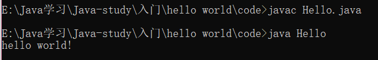
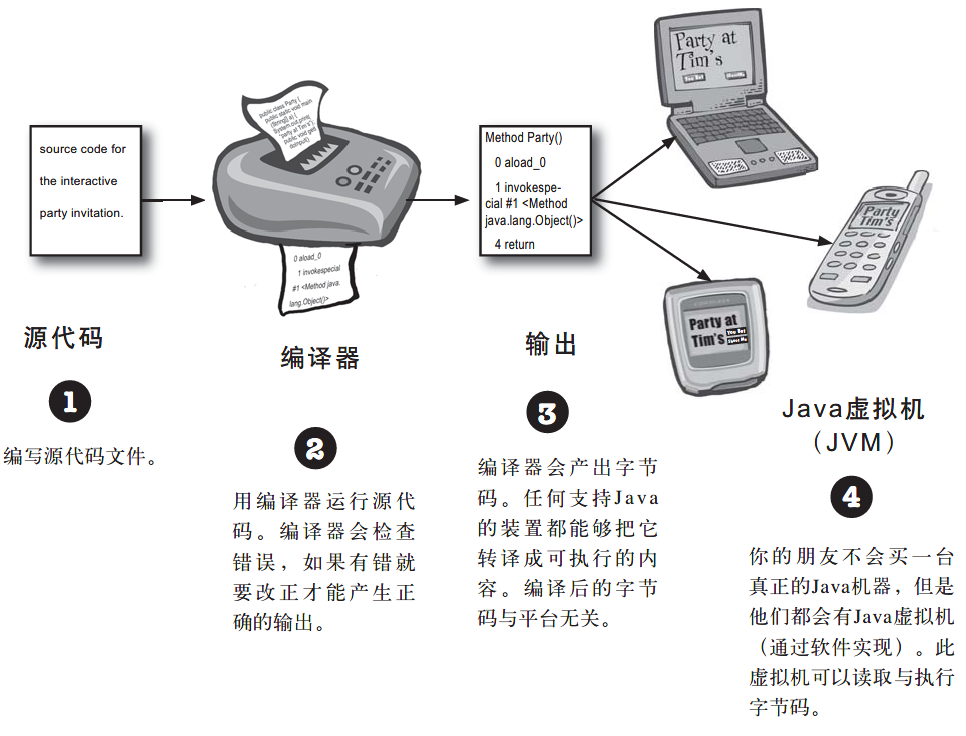
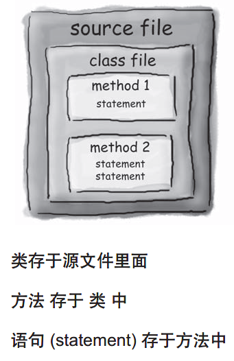

## Java简史

* 1991年，Sun公司的工程师小组在设计一种小型嵌入式产品时，设计了Oak语言

* 1995年，由于Oak已经被注册，更名为Java，并用于开发Web应用程序

* 2010年，Sun被Oracle公司收购，从此Java转到Oracle旗下

## Java名称来历
Java是印度尼西亚爪哇岛的英文名称，因盛产咖啡而闻名。


&nbsp;&nbsp;&nbsp;&nbsp;*Java的 logo也正是一杯热气腾腾的咖啡*

## Java三个版本

* Java SE：用于开发客户端的应用程序
* Java EE：用于开发服务器端的应用程序

* Java ME：用于开发移动设备的应用程序

## JDK 和 JRE

JDK：Java开发工具包

内含一套独立程序，每个程序从命令行调用

JRE：Java运行时的环境

包含在系统上运行Java程序所需的内容

JDK中包含了JRE

## 安装Java

请自行百度

## 第一个Java应用程序

> **安装并且环境配置好后我们可以尝试写第一个Java程序：**
> *首先我们先新建一个文本文档名称改为Hello*
> *然后将一下代码写入文档*
>
> ```java
> public class Hello {                            //创建一个公共类叫Hello，必须与文件名相同
> public static void main(String[] args) {		//定义main方法，一个程序的入口
> System.out.println("Hello World!");				//输出 Hello World！
>    }
> }
> ```
>
> *修改文档后缀为.java*
>
> *win+r打开运行窗口，输入cmd进入命令行*
>
> *先找到我们的程序Hello.java所在目录然后输入*
>
> ```
> javac Hello.java  //编译源代码，会生成一个Hello.class文件
> java Hello		  //运行Hello程序
> ```
>
> 
>
## java的工作方式



&nbsp;&nbsp;&nbsp;&nbsp;*图片来自于《Head First Java》*


## Java程序结构

> source file -- 源文件 （拓展名为 .java)
>
> class file    -- 类
>
> method     -- 方法 


&nbsp;&nbsp;&nbsp;&nbsp;*图片来自于《Head First Java》*

## 注释方法

```java
// 单行注释

/*  多行
	注释 */
```
