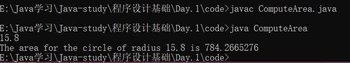
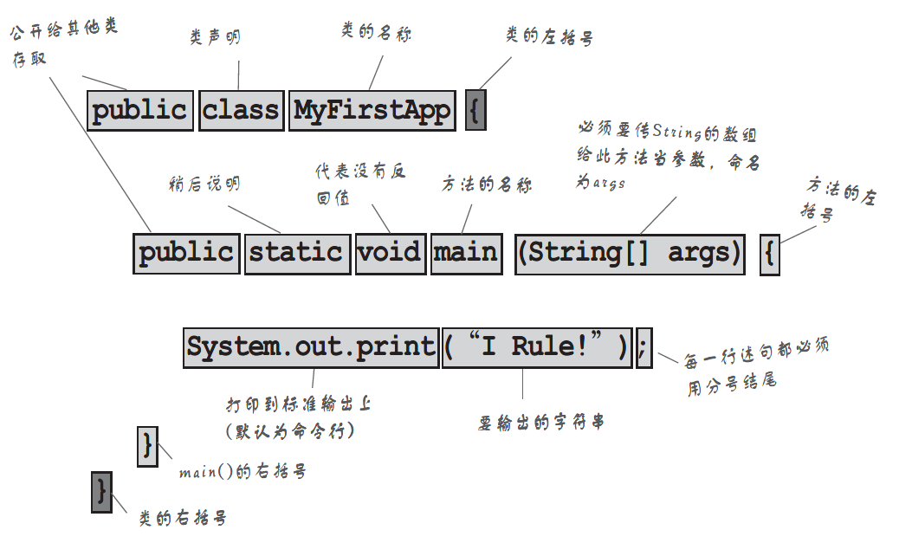

我们先来看段代码：
```java
import java.util.*;
public class ComputeArea{
    public static void main(String[] args) {
        double radius;
        double area;
        final double PI = 3.14159;
        
        Scanner input = new Scanner(System.in);
        
        radius = input.nextDouble();
        area = Math.pow(radius,2) * PI;
        
        System.out.print("The area for the circle of radius " + radius + " is " + area);
    }
}
```


#### 程序基础框架



&nbsp;&nbsp;&nbsp;&nbsp; *是的，图片还是来自于《Head First Java》 强推！！*


#### 变量

变量代表存储在计算机内存中的一个值。

```
 datatype constantname = value;
  数据类型    命名常量    = 值 ;
```

##### 数据类型：

> **整型：**
>
> |  类型   | 位数  |                  值                  |
> | :-----: | :---: | :----------------------------------: |
> |  byte   | 8bit  |             -128  ~  127             |
> |  short  | 16bit | -2<sup>15</sup>  ~  2<sup>15</sup>-1 |
> |   int   | 32bit | -2<sup>31</sup>  ~  2<sup>31</sup>-1 |
> |  long   | 64bit | -2<sup>63</sup>  ~  2<sup>63</sup>-1 |
>
> **浮点型：**
>
> | float  | 32bit |
> | :----: | :---: |
> | double | 64bit |
>
> **布尔型：**
>
> <table>
> <tr>
> <td><center>boolean</center></td>
> <td><center>true 或 false</centor></td>
> </tr>
> </table>
>
> **字符型：**
>
> <table border="1">
> <tr>
> <td><center>char</center></td>
> <td><center>16bit</centor></td>
> </tr>
> </table>

#### 常量

与变量相反，常量表示从不改变的数据。

```
final datatype CONSTANTNAME = value;
```

> 使用常量的三好处：
>
> 1. 当一个值多次使用的时候，不必重复输入。
> 2. 如果要改变常量值，只需在源代码中的一个地方做改动
> 3. 给常量赋一个描述性名字会提高程序易读性

#### 输入输出

Java使用`System.out`来表示标准输出设备

```java
System.out.print();      //输出后不换行
System.out.println();    //输出后换行
```

Java使用 `System.in`  来表示标准输出设备

```java
import java.util.*;			       // *号表示导入包java.util中所有的类

//创建一个Scanner类型的对象
Scanner input = new Scanner(System.in);        // Scanner input声明input是个Scanner类型的变量

radius = input.nextDouble();                   //输入的数值赋值给变量radius
/* 
	nextDouble()方法来读取double值
	相应的读取int值用nextInt（）
	*/
```

#### 数值操作符

+：加，-：减，*：乘，/：除，%：求余

%：取余数  20 % 3 = 2

#### 幂运算

Math.pow(a,b)   =   a<sup>b</sup>

#### 练习

##### 练习1：温度转换

> **提示**：*从控制台读入double型摄氏度温度值，然后转换为华氏温度。*
>
>&nbsp;&nbsp;&nbsp;&nbsp;华氏温度 = (9/5) * 摄氏度 + 32
