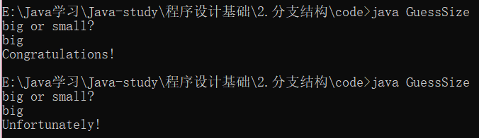
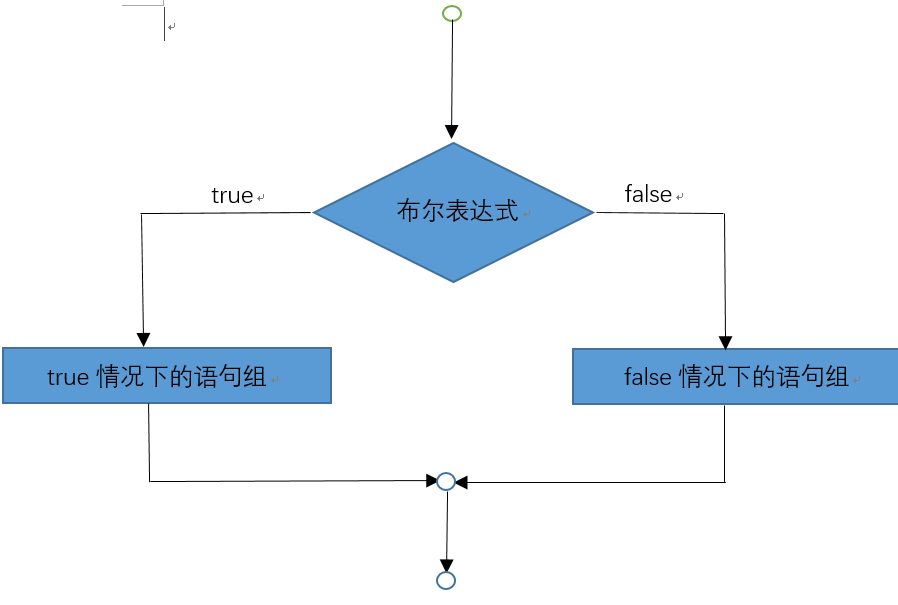

```java
public class GuessSize {
    public static void main(String[] args) {
        Scanner input = new Scanner(System.in);
		int resNum = (int)((Math.random()*6+1) + (Math.random()*6+1));
		String res;
        
        System.out.println("big or small?");
			String guess = input.next();
			
			if (resNum > 6) {
				res = "big";
			}
			else {
				res = "small";
			}
			//s1.equals(s2) 比较字符串s1和s2，返回true或者flase
			if (guess.equals(res)) {
				System.out.println("Congratulations!");
			}
			else {
				System.out.println("Unfortunately!");
			}
    }
}
```



## if - else语句



**双分支结构：**

```java
if (布尔表达式) {
    布尔表达式为真时执行的语句;
}
else (布尔表达式) {
    布尔表达式为假时执行的语句;
}
```

**多分支结构：**

```java
if (布尔表达式) {
    布尔表达式为真时执行的语句;
}
else if(布尔表达式) {
    布尔表达式为真时执行的语句;
}
else if(布尔表达式) {
    布尔表达式为真时执行的语句;
}
else (布尔表达式) {
    布尔表达式为假时执行的语句;
}
```

## 布尔表达式

> 布尔表达式的结果只有两种：true（1）和false（0）

**关系操作符：**

| 操作符 | 名称     | 示例    | 结果  |
| ------ | -------- | ------- | ----- |
| <      | 小于     | 10 < 0  | false |
| <=     | 小于等于 | 10 <= 0 | false |
| >      | 大于     | 10 > 0  | true  |
| >=     | 大于小于 | 10 >= 0 | true  |
| ==     | 等于     | 10 == 0 | false |
| !=     | 不等于   | 10 != 0 | true  |

## 逻辑操作符 <sup>[真值表](https://zh.wikipedia.org/wiki/逻辑运算符)</sup>

| 操作符 | 名称 | 说明                                       | 示例            |
| ------ | ---- | ------------------------------------------ | --------------- |
| ！     | 非   | 逻辑非（真的为假，假的为真）               | !false  (真)    |
| &&     | 与   | 逻辑与（两个同时为真时结果为真，否则为假） | 1 && 0 （假）   |
| \|\|   | 或   | 逻辑或（同时为假时结果为假，否则为真）     | 1 \|\| 0 （真） |
| ^      | 异或 | 逻辑异或（一个为真一个为假时结果为真）     | 1 ^ 0 （真）    |

## 产生随机数

> Math.random()会获得一个1.0到0.0之间随机double值，不包括1.0。

## 数据类型强制转换

```
datatype constantname = (datatype)value;
```

示例：

> `int a = (int)1.12`
>
> 浮点型转整型会导致精度缺失，只会留下小数点前的值。例：1.99 => 1

​	

## 练习

#### 1.练习：完善上面的赌博游戏

> **提示**：增加一个押单双的项目，玩家先选择玩**猜大小**还是**压单双**

#### 2.练习：彩票

> **提示**：开发一个玩彩票的游戏，程序随机地产生一个两位数的彩票
>
> 1）如果用户的输入从顺序到数字都匹配彩票数字，奖金为10,000元
>
> 2）如果用户输入的所有数字匹配彩票的所有数字，奖金为3,000元
>
> 3）如果用户输入的一个数字匹配彩票的一个数字，奖金为1,000元
