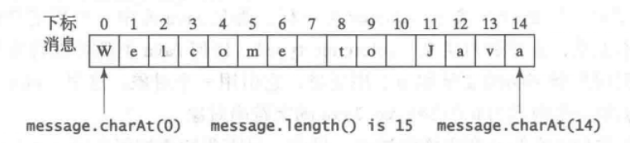

本章节将会重点介绍一些常用函数、方法，字符和字符串的操作。

## Math类

之前我们已经遇到了Math.pow(a,b)现在我们来了解一下其他的方法

| 方法      | 描述 |
| --------- | ---- |
|   exp(x)     | e<sup>x</sup> |
| log(x)    | log<sub>e</sub>x |
| log10(x)  |   log<sub>10</sub>x   |
| pow(a, b) | a<sup>b</sup> |
| sqrt(x)   | x开根 |

**取整方法**

| 方法     | 描述                                                         | 示例                                        |
| -------- | ------------------------------------------------------------ | ------------------------------------------- |
| ceil(x)  | 向上取整，返回双精度值(double)                               | Math.ceil(2.1) = 3.0 ; Math.ceil(-2.1)=-2.0 |
| floor(x) | 向下取整，返回双精度值                                       | Math.floor(2.1) = 2.0                       |
| rint(x)  | 取最接近的整数,若两边距离相同，则返回偶数                    | Math.rint(2.1) = 2.0 ；Math.ring(2.5) = 2.0 |
| round(x) | 单精度(float)返回 (int)Math.floor(x+0.5);  双精度返回 (long)Math.floor(x+0.5) | Math.round(2.6f)=3; Math.round(-2.6) = -3   |

**其他方法**

| 方法     | 描述                                      | 示例                                                    |
| -------- | ----------------------------------------- | ------------------------------------------------------- |
| max(a,b) | 返回最大值                                | Math.max(2.5, 3.9) = 3.9                                |
| min(a,b) | 返回最小值                                | Math.min(2.5, 3.9) = 2.5                                |
| abs(x)   | 返回绝对值                                | Math.abs(-1.5) = 1.5                                    |
| random() | 返回 [0.0,1.0) 之间的随机数(包含0不包含1) | (int)(Math.random() * 10) => 返回一个 0 ~ 9之间的随机数 |

## 字符

> `char letter = 'A';`
>
> **注：**字符类型定义时需要加上单引号，双引号的是字符串。

Java既支持[ASCII](https://zh.wikipedia.org/wiki/ASCII)码，也支持[Unicode](https://zh.wikipedia.org/wiki/Unicode)码。下面的语句是相等的：

```java
char letter = 'A';

//ASCII码
char letter = 65;
//Unicode码
char letter = '\u0041';
```


#### ASCII


常用字符的ASCII码:  

| 字符 | 十进制编码 | Unicode值 |
| ---- | ---------- | --------- |
|'0' ~ '9' | 48 ~ 57 |\u0030 ~ \u0039|
|'A' ~ 'Z' | 65 ~ 90 |\u0041 ~ \u005A|
|'a' ~ 'z' | 97 ~ 122 |\u0061 ~ \u007A|

#### 转义字符 \

| 转义序列 | 名称   |
| -------- | ------ |
| \b       | 退格键 |
| \t       | Tab键  |
| \n       | 换行符 |
| \f       | 换页符 |
| \r       | 回车符 |
| \\\      | 反斜杠 |
| \\"      | 双引号 |

若需要输出"\b"等,则使用"\\\b"。

示例：

```java
System.out.println("A\bB\tC\nD\\E\"F\\b");
/*显示：
B	C
D\E"F\b
```

两个字符之间是可以通过Unicode值来比较大小的，例：'a' < 'b'为true。

## 字符串

`String message = "Hello World!";`

> 字符串，顾名思义，一串字符连接成的。字符串中每个字符都有一个下标，下表从0开始：



&nbsp;&nbsp;&nbsp;&nbsp;&nbsp;&nbsp;*图片来自于《Java语言程序设计与数据结构》*

#### 从控制台读取字符串

```java
/*假定输入为：
Hello World! (回车键) */
import java.util.*;
 ......
Scanner input = new Scanner(System.in);
//以空白字符结束
String s1 = input.next();  		// s1 = "Hello"
//以按下回车键结束
String si = input.nextLine();   //s1 = "Hello World!"
```

#### 方法

```java
String s1 = "Hello World\t";
String s2 = "!";
```

| 方法          | 描述                                     | 示例                                                         |
| ------------- | ---------------------------------------- | ------------------------------------------------------------ |
| length()      | 返回字符串中的字符数                     | s1.length() = 12                                             |
| charAt(index) | 返回字符串中指定位置的字符               | s1.charAt(1) = 'e'                                           |
| concat(s2)    | 返回本字符串与s1字符串连接而成的新字符串 | s1.concat(s2) = "Hello world    !"                           |
| toUpperCase() | 返回所有字母大写的字符串                 | s1.toUpperCase() = "HELLO WORLD&nbsp;&nbsp;&nbsp;&nbsp;&nbsp;"                         |
| toLowerCase() | 返回所有字母小写的字符串                 | s1.toLowerCase() = "hello world&nbsp;&nbsp;&nbsp;&nbsp;&nbsp;" |
| trim()        | 返回去掉两头空白字符后的字符串           | s1.trim() = "Hello World"                                    |

#### 字符串比较

| 方法                    | 描述                                                         |
| ----------------------- | ------------------------------------------------------------ |
| equals(s1)              | 检查两字符串是否相等，返回true或false                        |
| equalsIgnoreCase(s1)    | 检查两字符串是否相等，返回true或false，不区分大小写          |
| compareTo(s1)           | 比较该字符串和s1，大于 = 返回一个大于0的整数，小于 = 小于0的整数，等于 = 返回0 |
| compareToIgnoreCase(s1) | 不区分大小写                                                 |
| startsWith(prefix)      | 检查字符串是否以特定前缀开始，返回true或false                |
| endsWith(suffix)        | 检查字符串是否以特定后缀开始，返回true或false                |
| contains(s1)            | 检查s1是否是该字符串的子字符串                               |

#### 获取子字符串

| 方法           | 描述                                                         |
| -------------- | ------------------------------------------------------------ |
| substring(a,b) | 返回从下标为a开始，到下标为b的字符结束的字符串(不包括下标为b的字符) |
| indexOf(s)     | 返回字符串中出现的第一个字符或字符串s的下标，如果没有，返回-1 |
| lastIndexOf(s) | 返回字符串中出现的最后一个字符或字符串s的下标，如果没有，返回-1 |

#### 字符串与数值之间的转换

**字符串转数值：**

```java
//int型
int intValue = Integer.parseInt(intString);
//double
double doubleValue = Double.parseDouble(doubleString);
```

**数值转字符串:**

```java
String s = number + "";
```


## 练习

#### 练习1：

> 编写代码，产生一个随机的小写字母。(不使用String类型)

#### 练习2：

> 编写一个找零程序，输入应付金额和实付金额，输出xx美元xx美分。
>
> 输出示例：
>
> > Enter the amount payable: $ 12.12 
> >
> > Enter the amount paid: $ 13.00 
> >
> > Give change: 0 dollar, 78 cent.

