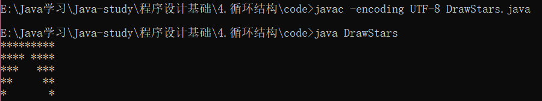
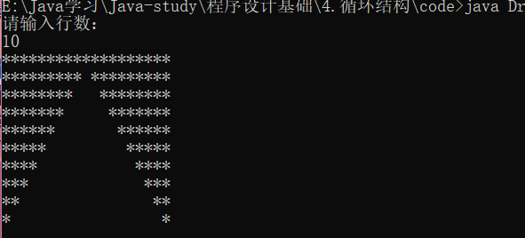

```java
/*打印图形
	*********
	**** ****
	***   ***
	**     **
	*       *
*/
public class DrawStars{
	public static void main(String[] args) {
        
		int i = 0;

		while(true) {
			if (i == 0) {
				for(int x=0; x<9; x++){       //打印第一行
					System.out.print("*");
				}
			}
			else if (i<5 && i>0) {			  //打印后几行
				for(int x=0; x<5-i; x++) {
					System.out.print("*");
				}
				for(int x=0; x<i*2-1; x++) {
					System.out.print(" ");
				}
				for(int x=0; x<5-i; x++) {
					System.out.print("*");
				}
			}
			else {			  //跳出循环
				break;
			 }
			i++;
			System.out.println();
		}
	}
}
```



**注：如果编译时出现中文编码错误请参考这里：[中文编码问题 GBK](https://jingyan.baidu.com/article/0f5fb099f170566d8334eabf.html)*

## 循环

人们讨厌重复的工作,但是计算机不讨厌。

#### while

```java
while(布尔表达式){
    //循环体
}
```

当布尔表达式为真时，执行循环体，直到布尔表达式为假。

示例：`while(i < 0){}    whlie(true){}`

**注：while(true)布尔表达式永远为真，循环将会一直持续下去。（不可使用 while(1)）*

#### for

```java
for(初始化; 布尔表达式; 更新) {
    //代码语句
}
```

在写循环时通常会使用这样的通用形式：

```java
int i = 0;
while(i < 5){
    ......
    i++;
}
```

for循环提供了一种更为简明的语法：

```java
for(int i=0; i<5; i++){
    ......
}
```

## break 和 continue

** break： **	  表示终止当前循环

** continue： **表示结束当前迭代

示例：

```java
int sum = 0;

for(int i=0; i<5; i++){     //循环将会迭代5次
    if(i = 1)	continue;	
    if(i = 4)	break;
    sum += i;
}
```

> 第一次迭代结果：sum = 0	i = 1
>
> 第二次迭代结果：sum = 0	i = 2      （因为当前迭代被跳过，所以sum += i没有被执行）
>
> 第三次迭代结果：sum = 2	i = 3
>
> 第四次迭代结果：sum = 5	i = 4
>
> 循环结束。

## 练习

#### 练习1：

> 定义一个字符串：abcdefghijklmnopqrstuvwxyz，然后倒序输出。

#### 练习2：

> 给之前的赌博游戏升升级。
>
> 1. 增加money和下注
>
> 2. money输光后停止游戏
> 3. money不可为负

#### 练习3：

> 更改本章开头给出的代码，要求简化程序代码并且让用户自己输入图形行数。
>
> 输出案例：
>
> 