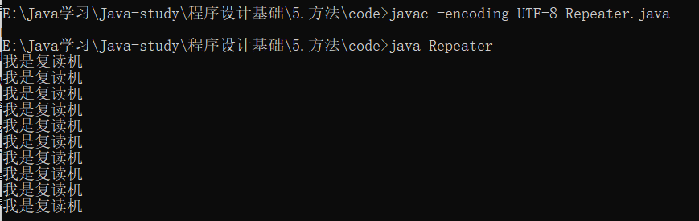

```java
public class Repeater{			//repeater 复读机
    public static void Repeat(){
        for (int i=0; i<10; i++){
            System.out.println("我是复读机");
        }
    }
    public static void main(String[] args){
        Repeat();
    }
}
```



> Java语言中的“方法”（Method）在其他语言当中也可能被称为“函数”（Function）。对于一些复杂的代码逻辑，如果希望重复使用这些代码，并且做到“随时任意使用”，那么就可以将这些代码放在一个大括号“{}”当中，并且起一个名字。使用代码的时候，直接找到名字调用即可。

## 定义方法

```java
public static 返回值类型 方法名(形式参数) {		//方法头
	// 方法体 ;
}
```

**示例：**

```java
public static int max(int x,int y) {   //返回值res为int型
    int res;
    
    if (x > y){
        res = x;
    } 
    else (x < y){
        res = y;
    }
    return res;     //返回res的值
}
```

```java
public static void min(int i,int y){  //无返回值用 void
    int res;
    
    if (x > y){
        res = x;
    } 
    else (x < y){
        res = y;
    }
    System.out.println("The min is " + res);
}
```


## 调用方法

> 常见的有三种：
> 单独调用。这种方式无法使用方法的返回值。格式：方法名称(参数值);
> 打印调用。这种方式可以将方法的返回值直接打印。格式：System.out.println(方法名称(参数值));
> 赋值调用。这种方式可以将方法的返回值赋值给一个变量，注意变量的数据类型必须和方法的返回值类型对应。格式：数据类型变量名称= 方法名称(参数值)

**示例：**

```java
min(3, 4);   //单独调用

System.out.println("The max is "max(3, 4));	//打印调用

int max = max(3, 4);	//赋值调用
```

*调用时括号里的值为实际参数；定义方法时方法头的括号的值为形式参数。形参和实参并不是必须要有的，根据解决的问题而定。*

## 重载方法

重载方法允许你可以使用同样的名字来定义不同方法，只要它们的参数列表是不同的。

```java
public static double max(double x, double y){
    //方法体 ;
}
public static int max(int x, int y){
    //方法体 ;
}
```

调用时会根据你的实参类型选择方法。

## 变量的作用域

在循环和方法中定义的变量为局部变量，仅在循环和方法里能够使用。

## 练习

#### 练习1

> 方法可以使代码模块化，使得程序更容易维护和调试，提高代码的复用性。我们现在手里就有一个臃肿的代码——赌博游戏，现在我们来优化一下吧。

#### 练习2

> 在上题已优化的代码上在加一个游戏项目：
>
> CRAPS又称花旗骰，是美国拉斯维加斯非常受欢迎的一种的桌上赌博游戏。该游戏使用两粒骰子，玩家通过摇两粒骰子获得点数进行游戏。简单的规则是：玩家第一次摇骰子如果摇出了7点或11点，玩家胜；玩家第一次如果摇出2点、3点或12点，庄家胜；其他点数玩家继续摇骰子，如果玩家摇出了7点，庄家胜；如果玩家摇出了第一次摇的点数，玩家胜；其他点数，玩家继续要骰子，直到分出胜负。