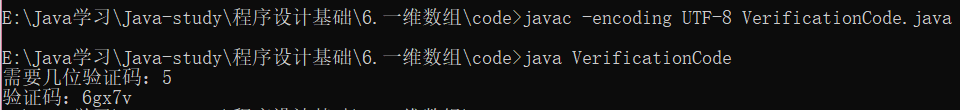

```java
import java.util.*;
public class VerificationCode {
	public static char ls(){
		char ch;
		char[] VerifyCode = {'0', '1', '2', '3', '4', '5', '6', '7', '8', 
				'9', 'A', 'B', 'C', 'D', 'E', 'F', 'G', 'H', 'I', 'J', 'K', 
				'L', 'M', 'N', 'O', 'P', 'Q', 'R', 'S', 'T', 'U', 'V', 'W', 
				'X', 'Y', 'Z', 'a', 'b', 'c', 'd', 'e', 'f', 'g', 'h', 'i', 
				'j', 'k', 'l', 'm', 'n', 'o', 'p', 'q', 'r', 's', 't', 'u', 
				'v', 'w', 'x', 'y', 'z'};
		
		ch = VerifyCode[(int)(Math.random() * 63)];

		return ch;
	}
	
	public static void main(String[] args) {
		int len;
		Scanner input = new Scanner(System.in);
		System.out.print("需要几位验证码：");
		len = input.nextInt();
		
		System.out.print("验证码：");
		for(int i=0; i<len; i++) {
			System.out.print(ls());
		}
	}
}
```



## 数组

> 一旦数组被创建，它的大小是固定的。

#### 数组的声明、创建和初始化

数组的声明、创建和初始化按初始化的不同有两种方法：

* 静态初始化：程序员确定每个数组元素的初始值，数组长度由系统自己生成。

  ```java
  elementType[] arrayRefVar = {?, ?, ......};
  ```

  示例：

  ```java
  int[] number = {0, 1, 2, 3, 4, 5, 6, 7, 8, 9};
  ```

  

* 动态初始化：程序员确定数组长度，初始值由系统来分配（默认值全为0）

  ```java
  elementType[] arrayRefVar = new elementType[arraySize];
  arrayRefVar[0] = ?;
  arrayRefVar[1] = ?;
      ......
  arrayRefVar[arraySize-1] = ?;
  ```

  示例：

  ```java
  int[] number = new int[10];
  for(int i=0; i<10; i++){
      number[i] = i;
  }
  ```

## 数组的查找

#### 线性查找

> 使用循环对数组进行遍历，每个元素进行进行对比。

#### 二分查找法

> 前提：数组元素是有序排列的
>
> 每次取中间元素来进行比较，大了在数组的前一半继续；小了在数组后一半找。
>
> （若数组是偶数，比如4，下标的中间值为1.5，取1）

## 数组的排列

> 排列最直接的方法就是把最小的找出来放在第一位，依次把整个数组按升序排列。这种方法我们不做讨论，这里主要介绍一种冒泡排序。

#### 冒泡排序

> 从第一个数开始，依次往后比较，如果前面的数比后面的数大就交换，否则不作处理。这就类似烧开水时，壶底的水泡往上冒的过程。

```java
public class BubbleSort{
    public static void main(String[] args){
        int[] number = {4, 2, 3, 1, 0};
        
        for(int i=0; i<number.length-1; i++){
            for(int j=0; j<number.length-1-i; j++){
                if(number[j]>number[j+1]){
                    int temp = number[j];
                	number[j] = number[j+1];
                    number[j+1] = temp;
                }
            }
        }
    }
}
```

|       | 第一轮(i = 0) | 第二轮(i = 1) | 第三轮(i = 2) | 第四轮(i = 3) |
| ----- | ------------- | ------------- | ------------- | ------------- |
| j = 0 | 2 4 3 1 0     | 2 3 1 0 4     | 1 2 0 3 4     | 0 1 2 3 4     |
| j = 1 | 2 3 4 1 0     | 2 1 3 0 4     | 1 0 2 3 4     |               |
| j = 2 | 2 3 1 4 0     | 2 1 0 3 4     |               |               |
| j = 3 | 2 3 1 0 4     |               |               |               |

## Arrays类

#### 排序

可以使用`Arrays.sort()` 和`Arrays.parallelSort()`对数组排序（是的，这个方法比上一个简单多了）

示例：

```java
import java.util.*;

Arrays.sort(number);	//单线程排序，快速处理较小的数据集
Arrays.parallelSort(number);	//多线程排序，为大型数据集提供更好的性能
```

也可以对部分数组排序：

```java
import java.util.*;

Arrays.sort(number, 0, 3);	//对下标为0，1，2的数组排序
Arrays.parallelSort(number, 0, 3);
```

#### 二分查找法

```java
import java.util.*;

Arrays.binarySearch(number, 2);	//返回下标
```

#### equals

```java
import java.util.*;

Arrays.equals(list1, list2);	//检查两个数组是否相等
```

#### fill

```java
import java.util.*;

Arrays.fill(list1, 5);	//给整个数组填充5
Arrays.fill(list1, 0, 3, 8);	//给下标0，1，2填充8
```

## 练习

#### 练习1

> 输入多个分数，存在数组中，返回平均分，统计及格人数和不及格人数。

