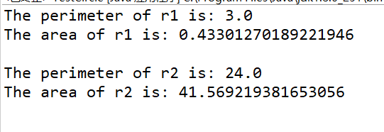
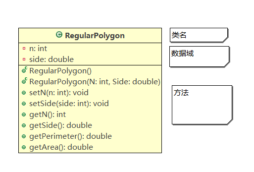

## 面向对象与面向过程

[面向对象与面向过程的本质的区别](https://blog.csdn.net/jerry11112/article/details/79027834)

## 对象和类

```java
public class RegularPolygon {
    // 数据域
	private int n = 3;
	private double side = 1;
	
    // 构造方法
	public RegularPolygon() {
	}
	
	public RegularPolygon(int n, double side) {
		this.n = n;
		this.side = side;
	}
	
    // 方法
	public void setN(int n) {
		this.n = n;
	}
	
	public void setSide(int side) {
		this.side = side;
	}
	
	public int getN() {
		return n;
	}
	
	public double getSide() {
		return side;
	}
	
	public double getPerimeter() {
		return n * side;
	}
	
	public double getArea() {
		return (n * Math.pow(side, 2)) / (4 * Math.tan(Math.PI / n));
	}
}
```

```java
public class TestRegularPolygon {
	public static void main(String args[]){
        // 创建对象r1
        RegularPolygon r1=new RegularPolygon();
        System.out.println("The perimeter of r1 is: "+r1.getPerimeter());
        System.out.println("The area of r1 is: "+r1.getArea()+"\n");
        
        //创建对象r2
        RegularPolygon r2=new RegularPolygon(6,4);
        System.out.println("The perimeter of r2 is: "+r2.getPerimeter());
        System.out.println("The area of r2 is: "+r2.getArea()+"\n");
    }
}
```



### 定义类和创建对象

> 上面的代码定义了一个RegularPolygon（正多边形）类与使用该类创建对象的程序TestRegularPolygon。
>
> 两个class可以放在一个java文件里，不过public类只能有一个且必须与文件同名。因此文件名应为TestRegularPolygon.java并去掉RegularPolygon类的public。
>
> 无论是放在一个文件还是两个文件编译后都会生成两个.class文件。
>
> 一个类包含了数据域、构造方法、方法。

#### 数据域

> java使用变量来定义数据域。
>
> 修饰符：private表示该数据只有当前类可以访问（使用private将数据域的访问权限修改也叫作数据域封装），目的是为了防止类中的数据成员，在类的定义之外被修改（只能调用该类的方法时修改）。

#### 构造方法和创建对象

> 构造方法：其他类可以通过调用该方法构造一个新对象。
>
> ​					必须和所在类同名
>
> ​					没有返回值，void也没有
>
> 创建对象：用new操作符调用构造方法

**无参构造方法：**

```java
public RegularPolygon() {
}
```

**有参构造方法：**

> 调用该构造方法时可以传参来修改数据域

```java
public RegularPolygon(int n, double side) {
	this.n = n;
	this.side = side;
}
```

**对象创建：**

> 对象可以通过对象引用变量（objectRefVar）来访问。		*其实就是给对象取个名字*

```java
ClassName objectRefVar = new ClassName();	// 括号写参数
```

### 访问对象的数据和方法

#### 数据：

> **public和无修饰符：** 使用点操作符（.）	`r1.n;`		`r2.side =100; `
>
> **private:** 通过set方法（修改器）和get方法（访问器）来修改和获取数据

```java
public void setN(int n) {
	this.n = n;
}
	
public int getN() {
	return n;
}
```

#### 方法：

> 我们之前已经调用过很多的方法了，比如：input.nextInt();等等
>
> 对象引用变量 . 方法名(参数) 即可。

### 静态变量和方法

**静态变量：**

> 在不同的对象中的数据是不能共享的，改变了r1.n的值并不会影响到r2，静态变量将会把变量值保存在一个公共的内存地址，如果某个对象修改了静态变量的值，那么同一类的所有对象都会受到影响。

**静态方法：**

> 不需要创建对象就可以使用，如Math类中的所有方法。

**声明**：

>  只需要添加修饰符 static 即可

```java
static int n;

static int getN(){
    return n;
}
```

**调用：**

> 方法：类 . 方法(参数)
>
> 变量：类 . 变量

#### this引用

> 关键字this引用对象自身，当方法的参数和数据域重名时使用this来访问数据域

```java
private int n = 3;

public void setN(int n) {
	this.n = n;
}
```

> 也可以用来调用另一个构造方法

```java
public class Dome{
    // 数据域没有默认值
    int n;
    double side;
    
    //在主方法调用无参构造方法时，该方法会调用另一个方法并传递参数n=3、side=1
    public RegularPolygon() {
        this(3,1);
	}
	
	public RegularPolygon(int n, double side) {
		this.n = n;
		this.side = side;
	}
}
```

```java
public class TestDome{
    public static void main(String[] args) {
        Dome dome1 = new Dome();
    }
}
```

## UML类图

> UML类图能够直观的看出一个类的数据域和方法，上面例子的UNL类图如下：



## 练习

#### 练习一

> 将我们的赌博游戏再次升级
>
> ​	要求：1、赌金为私有数据，可充值不可提现，可查询
>
> ​				2、请随意发挥